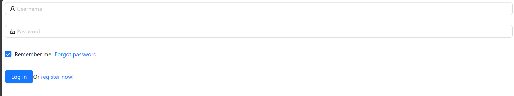

# LMS
 <h1>Library Management System</h1>
 

This is a library management system used by patrons and admin to manage books.

</b>
<h3>Screenshots of the app</h3>
 
<h5>Register page</h5>

<h5>Login Page</h5>

<h5>Home Page</h5>

<h5>Find Book Page</h5>

<h5>Search Results</h5>

<h5>Book details Page</h5>
